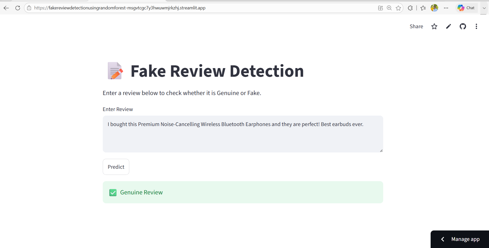
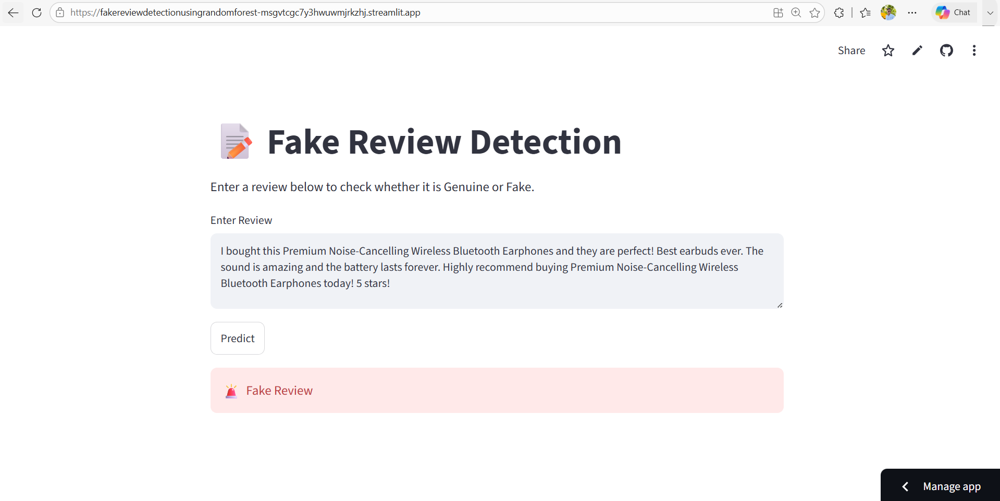

# Fake Review Detection Using Random Forest

## Overview

This project is a Machine Learning-based Fake Review Detection system that classifies customer reviews as **Genuine** or **Fake**. The application uses Natural Language Processing (NLP) techniques to preprocess review text and converts it into numerical features using TF-IDF Vectorization. A Random Forest Classifier is trained on the processed data to predict whether a review is authentic or deceptive. The trained model is deployed through a Streamlit web application, allowing users to enter a review and receive an instant prediction.

Check out: 
https://fakereviewdetectionusingrandomforest-msgvtcgc7y3hwuwmjrkzhj.streamlit.app/

## Features

* Text preprocessing and cleaning
* TF-IDF Vectorization for feature extraction
* Random Forest Classifier for review classification
* Interactive Streamlit web application
* Model and vectorizer saved using Pickle
* Real-time prediction for user-entered reviews

## Technologies Used

* Python
* Pandas
* NumPy
* Scikit-learn
* NLP
* Streamlit
* Pickle

## Machine Learning Workflow

1. Load and explore the dataset.
2. Perform text preprocessing (lowercasing, punctuation removal, stopword removal, etc.).
3. Convert text into numerical features using TF-IDF Vectorizer.
4. Split the dataset into training and testing sets.
5. Train a Random Forest Classifier.
6. Evaluate the model using Accuracy, Confusion Matrix, and Classification Report.
7. Save the trained model and vectorizer using Pickle.
8. Deploy the model with Streamlit for real-time predictions.

## Future Improvements

* Compare multiple machine learning algorithms such as Logistic Regression, Naive Bayes, and Support Vector Machine.
* Add advanced NLP preprocessing such as lemmatization.
* Improve prediction accuracy through hyperparameter tuning.
* Deploy the application on Streamlit Community Cloud.

  
  
